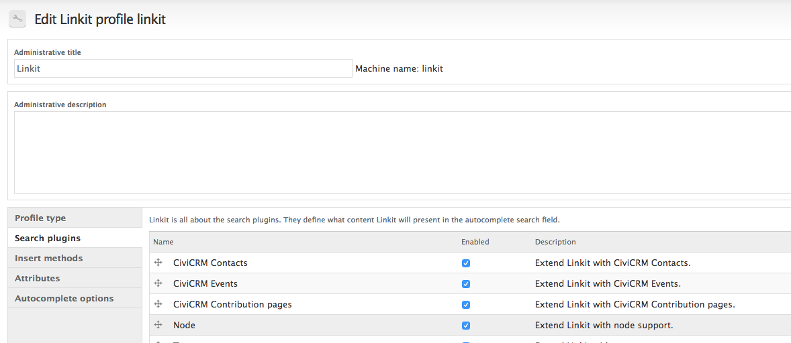
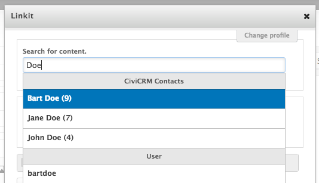
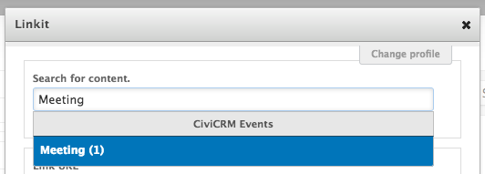
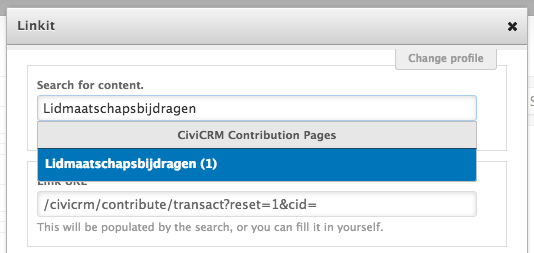

# Installation
This module is installed as any other Drupal module.

- with drush:
```drush pm-enable -y civicrm_linkit```

## Usage

- Add CiviCRM Search Plugins to your Linkit profile<br>


- Search for Contacts<br>


- Search for Events<br>


- Search for Contribution Pages<br>

